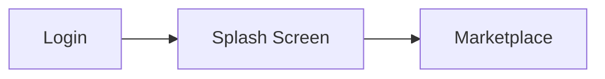

# NEURO-TOXIN: The VIT-AP Zombie Exchange

Welcome to the blackout economy.
NEURO-TOXIN is a post-apocalyptic marketplace where students trade rare artifacts, salvage-grade relics, and last-chance survival assets in a high-stakes auction arena.

## The Hook

Civilization crashed. Value mutated.
Inside VIT-AP’s underground exchange, students become traders, bidders, and vault runners—flipping rare artifacts before the next siren goes off.

## Feature Roadmap

- **AB-1: Rare Bidding**  
	Live bidding system for high-value, limited-stock artifacts.

- **AB-2: Merchant Portal**  
	Dedicated console for verified merchants to list, manage, and monitor lots.

- **Evil Captcha Security System**  
	Friction-heavy anti-bot gate designed to keep automated raiders out.

## Tech Stack

- **Frontend:** React + Tailwind CSS
- **Backend:** Node.js
- **Logic Generation:** GPT-5.3-Codex

## User Flow



## Judge Quick Start

Use this section to run the project on a fresh machine in under 5 minutes.

1. Clone the repository:

```bash
git clone https://github.com/dhaya-nandha/Dumbathon_team_rocket.git
cd Dumbathon_team_rocket
```

2. Install dependencies:

```bash
cd client && npm install
cd ../server && npm install
```

3. Run backend API:

```bash
cd server
npm run dev
```

4. In a new terminal, run frontend:

```bash
cd client
npm run dev
```

5. Open in browser:
- Frontend: `http://localhost:5173`
- API health check: `http://localhost:4000/api/health`
- Lots endpoint: `http://localhost:4000/api/lots`

Prerequisite: Node.js LTS installed (includes npm).

## Local Dev

1. Install dependencies:

```bash
cd client && npm install
cd ../server && npm install
```

2. Start both apps:

```bash
cd client
npm run dev
```

```bash
cd server
npm run dev
```

Default URLs:
- Client: `http://localhost:5173`
- Server: `http://localhost:4000`
